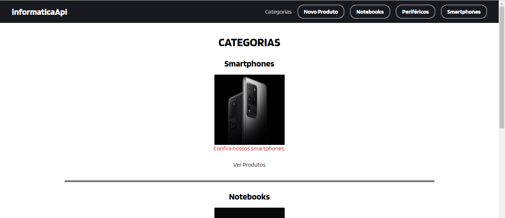
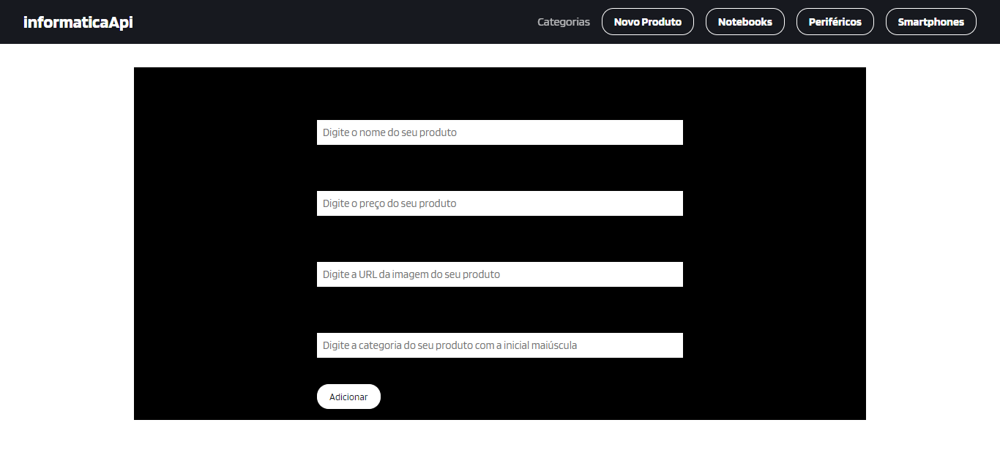
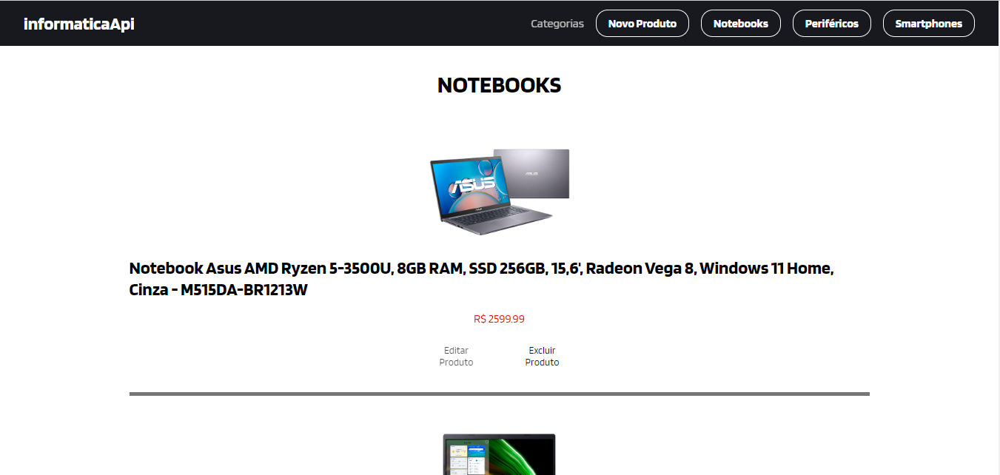

 
<h1> Projeto em grupo do modulo 3</h1>
  
<h2>Objetivo: Criar um site utilizando o Json-server criado no projeto individual do módulo. </h2>
  

Neste projeto, criamos um site utilizando dados de uma Api através dos métodos HTTP: get,post, put e delete. Suas funções são as seguintes: 

  

    □GET - Requisito para trazer os dados da Api para os componentes;
    

    □ POST - Requisito que adiciona novos dados ao servidor;
    

    □ PUT - Requisito de edição dos dados já existentes;
    

    □ DELETE - Exclui objetos do servidor através do "Id".

      
    
Foram instaladas no projeto as bibliotecas react-router-dom e axios.

      
    

    
Com essas informações foram criadas as rotas que trazem produtos de informática: Smartphones, Notebooks e Periféricos.

    

        

  
        

    

    
O botão "Novo Produto" leva a uma rota de formulário para inclusão de dados no servidor

    

        

  
        

    

    
Ao clicar na rota referente a uma categoria de produtos são exibidas informações e os botões que executam as funções Editar e Excluir produtos.

    

        

  
        

    

    
Conteudo de referência e produção do projeto: https://www.youtube.com/watch?v=NbhoeLj6lBs&t=1766s

    
        

